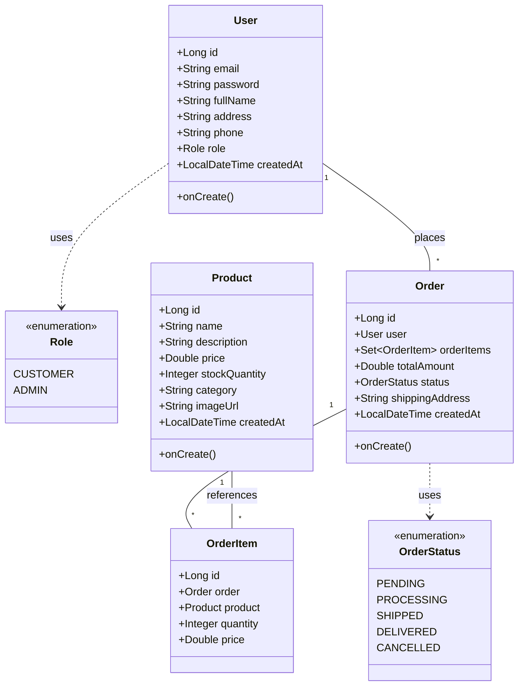
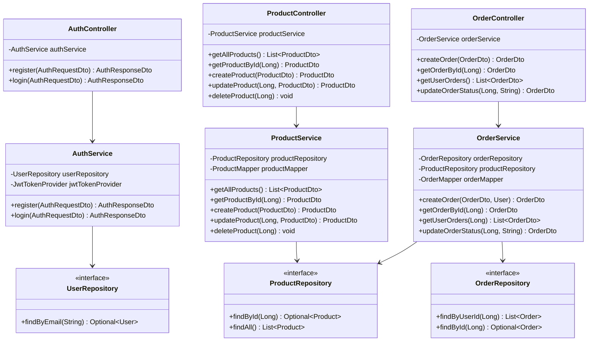
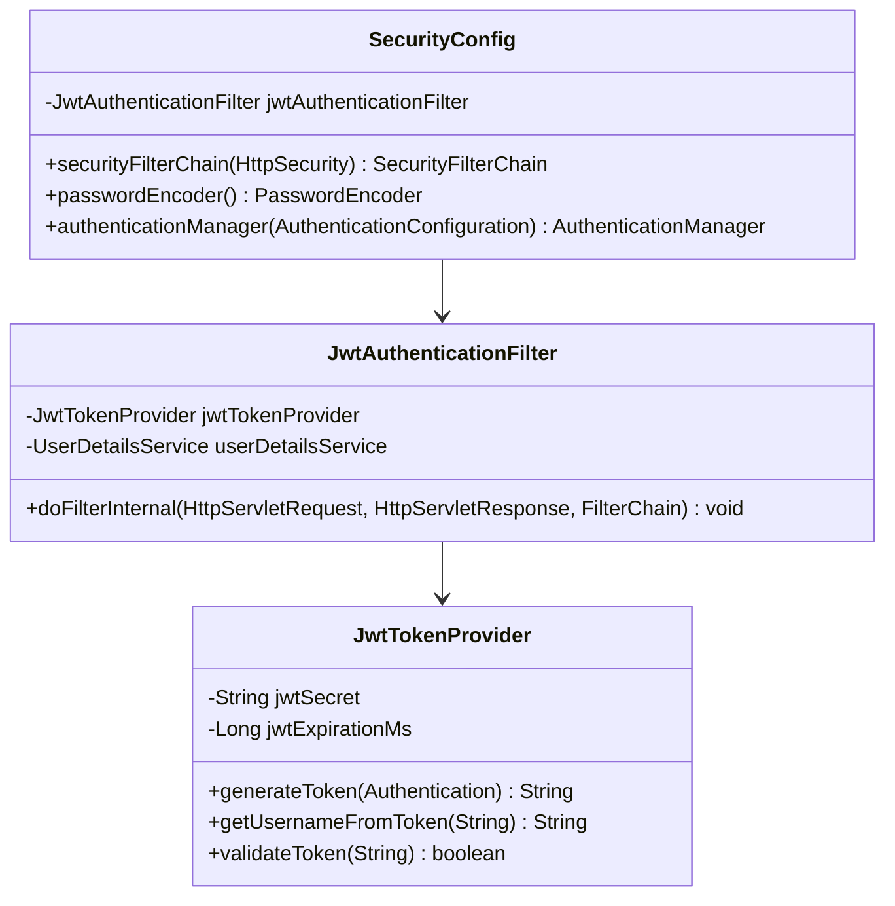
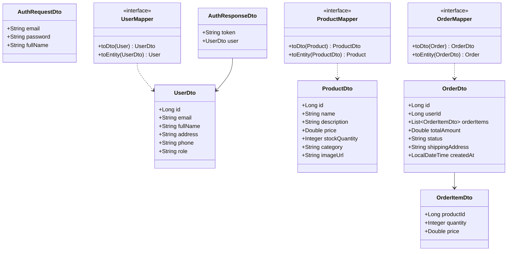

# E-Commerce API

A RESTful API for an e-commerce platform built with Spring Boot, JWT authentication, and PostgreSQL.

## 🏗️ Architecture

This application follows a layered architecture pattern with clear separation of concerns:

```
┌─────────────────────────────────────────────────────────────┐
│                      Presentation Layer                      │
│                       (Controllers)                          │
└─────────────────────────────────────────────────────────────┘
                              │
┌─────────────────────────────────────────────────────────────┐
│                      Business Layer                          │
│                        (Services)                            │
└─────────────────────────────────────────────────────────────┘
                              │
┌─────────────────────────────────────────────────────────────┐
│                      Data Access Layer                       │
│                      (Repositories)                          │
└─────────────────────────────────────────────────────────────┘
                              │
┌─────────────────────────────────────────────────────────────┐
│                    Database (PostgreSQL)                     │
└─────────────────────────────────────────────────────────────┘
```

## 📊 UML Class Diagram

### Entity Model



### Application Architecture



### Security Components



### Data Transfer Objects (DTOs) and Mappers



## 🛠️ Technology Stack

- **Framework**: Spring Boot 3.2.1
- **Language**: Java 21
- **Database**: PostgreSQL
- **Security**: Spring Security + JWT
- **ORM**: Spring Data JPA (Hibernate)
- **Mapping**: MapStruct 1.6.3
- **Build Tool**: Maven
- **Documentation**: SpringDoc OpenAPI 2.5.0
- **Container**: Docker Compose

## 📦 Key Dependencies

| Dependency | Version | Purpose |
|------------|---------|---------|
| Spring Boot | 3.2.1 | Core framework |
| Spring Security | 3.2.1 | Authentication & Authorization |
| JWT | 0.12.5 | Token-based authentication |
| PostgreSQL | Latest | Database |
| MapStruct | 1.6.3 | DTO mapping |
| Lombok | 1.18.42 | Boilerplate code reduction |
| OpenFeign | 2023.0.3 | HTTP client |
| SpringDoc | 2.5.0 | API documentation |

## 🚀 Getting Started

### Prerequisites

- Java 21
- Maven 3.x
- Docker & Docker Compose
- PostgreSQL (or use Docker Compose)

### Installation

1. Clone the repository
```bash
git clone <repository-url>
cd E-Commerce-API
```

2. Start PostgreSQL with Docker Compose
```bash
docker-compose up -d
```

3. Build the project
```bash
mvn clean install
```

4. Run the application
```bash
mvn spring-boot:run
```

The API will be available at `http://localhost:8080`

## 📚 API Documentation

Once the application is running, access the interactive API documentation at:
- Swagger UI: `http://localhost:8080/swagger-ui.html`
- OpenAPI JSON: `http://localhost:8080/v3/api-docs`

## 🔐 Security

The API uses JWT (JSON Web Token) for authentication. The security flow:

1. User registers or logs in via `/api/auth/register` or `/api/auth/login`
2. Server returns a JWT token
3. Client includes the token in the `Authorization` header for subsequent requests: `Authorization: Bearer <token>`
4. JwtAuthenticationFilter validates the token on each request

### Roles

- **CUSTOMER**: Default role for registered users
- **ADMIN**: Administrative privileges

## 📁 Project Structure

```
src/main/java/com/ecommerce/
├── config/              # Security and application configuration
│   └── SecurityConfig.java
├── controller/          # REST endpoints
│   ├── AuthController.java
│   ├── OrderController.java
│   └── ProductController.java
├── dto/                 # Data Transfer Objects
│   ├── AuthRequestDto.java
│   ├── AuthResponseDto.java
│   ├── OrderDto.java
│   ├── OrderItemDto.java
│   ├── ProductDto.java
│   └── UserDto.java
├── entity/              # JPA entities
│   ├── Order.java
│   ├── OrderItem.java
│   ├── Product.java
│   └── User.java
├── mapper/              # MapStruct mappers
│   ├── OrderMapper.java
│   ├── ProductMapper.java
│   └── UserMapper.java
├── repository/          # Data access layer
│   ├── OrderRepository.java
│   ├── ProductRepository.java
│   └── UserRepository.java
├── security/            # JWT security components
│   ├── JwtAuthenticationFilter.java
│   └── JwtTokenProvider.java
├── service/             # Business logic
│   ├── AuthService.java
│   ├── OrderService.java
│   └── ProductService.java
└── EcommerceApplication.java  # Main application class
```

## 🔄 Database Schema

The application uses the following main tables:
- `users` - User accounts and authentication
- `products` - Product catalog
- `orders` - Customer orders
- `order_items` - Individual items within orders

## 🤝 Contributing

1. Fork the repository
2. Create a feature branch (`git checkout -b feature/AmazingFeature`)
3. Commit your changes (`git commit -m 'Add some AmazingFeature'`)
4. Push to the branch (`git push origin feature/AmazingFeature`)
5. Open a Pull Request

## 📝 License

This project is a demo application for learning purposes.

